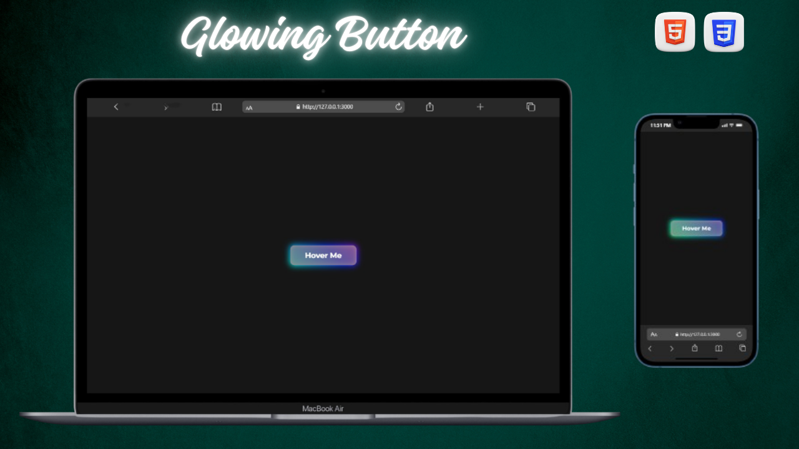

# Glowing Button ✨

This is a small practice project where I created a glowing button effect using **HTML** and **CSS**.  
It was built to practice hover effects, transitions, and glowing UI designs.

---

## 🎨 Preview

---

## 🔥 Features
- Smooth hover transition  
- Modern glowing effect  
- Easy to customize  

---

## 🛠️ Technologies Used
- HTML  
- CSS

---

## 📂 Source Code

🔗 [GitHub Repository](https://github.com/nufail-01/glowing-button)

---

## 🤝 Connect with Me

🔗 [LinkedIn](https://www.linkedin.com/in/nufailshaikh/) 

---
